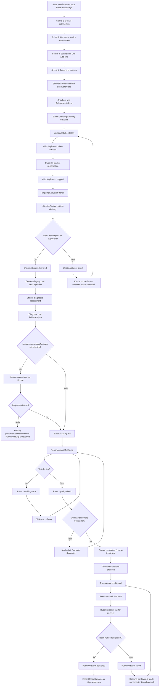

# Flowchart: Buchungs-/Order- und Reparaturprozess

## Hinweise

- Der Ablauf kombiniert den Order-Flow (5-Step Buchung + Checkout), den DHL-Shipping-Status-Flow und den internen Repair-Status-Flow.
- Entscheidungsstellen (z. B. Freigabe, Teileverfuegbarkeit, QA-Ergebnis) sind als Verzweigungen modelliert.
- Rueckversand ist als eigener Shipping-Teilprozess enthalten.
