# Staff Nutzerhandbuch - FixitHub

## 1. Ziel und Geltungsbereich
Dieses Dokument ist das interne Schulungs- und Nachschlagehandbuch fuer den Staff-Bereich von FixitHub. Es beschreibt die Navigation, die operative Nutzung der Staff-Seiten, die wichtigsten Bearbeitungsdialoge und die verbindlichen Standardablaeufe im Tagesbetrieb.

Das Handbuch richtet sich an neue und bestehende Mitarbeiter mit Rolle `staff` sowie an Administratoren, die Staff-Prozesse mitbedienen. Der inhaltliche Schwerpunkt liegt auf der sicheren und nachvollziehbaren Bearbeitung von Auftraegen. Deshalb wird die gemeinsame Auftragsdetailseite `/orders/:id` als zentraler Arbeitsbereich gesondert und vertieft behandelt.

Das Handbuch basiert auf den aktuell implementierten Staff-Routen, den verfuegbaren UI-Komponenten im Client und dem derzeitigen Funktionsstand des Systems.

## 2. Zugriff und Berechtigungen
- Der Staff-Bereich ist fuer Rollen `staff` und `admin` freigegeben.
- Zentrale Startseite: `/staff`
- Operative Kernrouten:
  - `/staff/orders`
  - `/staff/repair-requests`
  - `/staff/bookings`
  - `/staff/time-tracking`
  - `/staff/schedule`
  - `/staff/knowledge-base`
  - `/staff/chat`
  - `/staff/performance`
- Die Auftragsdetailseite selbst liegt nicht unter `/staff/...`, sondern unter `/orders/:id`.

**Schulungsziel nach Abschluss dieses Handbuchs:**
- die Sidebar und alle wesentlichen Staff-Seiten sicher einordnen koennen
- eigene Auftraege systematisch abarbeiten koennen
- Status, Leistungen, Material, Workflow und Kommunikation fachlich korrekt dokumentieren koennen
- erkennen, welche Bereiche produktiv arbeiten und welche derzeit nur Vorschau- oder Mockcharakter haben

## 3. Bedienkonzept und Arbeitslogik im Staff-Bereich
- Die linke Sidebar ist nach Arbeitskontext gegliedert.
- Der obere Bereich dient der operativen Steuerung: Dashboard, Auftraege, Reparaturanfragen, Buchungen.
- Der mittlere Bereich dient der persoenlichen Arbeitsorganisation: Zeiterfassung und Terminplanung.
- Der untere Bereich stellt unterstuetzende Werkzeuge bereit: Wissensdatenbank, Team-Chat und Performance-Sicht.
- Gemeinsame Service-Seiten wie Nachrichten, Benachrichtigungen und Profil bleiben aus dem Staff-Bereich direkt erreichbar.
- Viele Staff-Ansichten sind Uebersichts- oder Listenansichten. Verbindliche Bearbeitungsschritte werden in Detailseiten oder Dialogen ausgefuehrt.

**Verbindliche Arbeitsgrundsaetze:**
- Jeder Statuswechsel muss dem realen Bearbeitungsstand entsprechen.
- Jede relevante Rueckfrage, Klarstellung oder Kundenkommunikation ist im passenden Kontext zu dokumentieren.
- Leistungen, Material und Zusatzpositionen duerfen nur dann angepasst werden, wenn der fachliche Bedarf geprueft wurde.
- Vor aktiver technischer Bearbeitung sind Geraet, Lock-Informationen und Inspektionsstatus zu plausibilisieren.
- Nicht produktiv angebundene Vorschau-Bereiche duerfen nicht als alleinige Entscheidungsgrundlage verwendet werden.

## 4. Sidebar-Struktur und Menuefuehrung

### 4.1 Dashboard

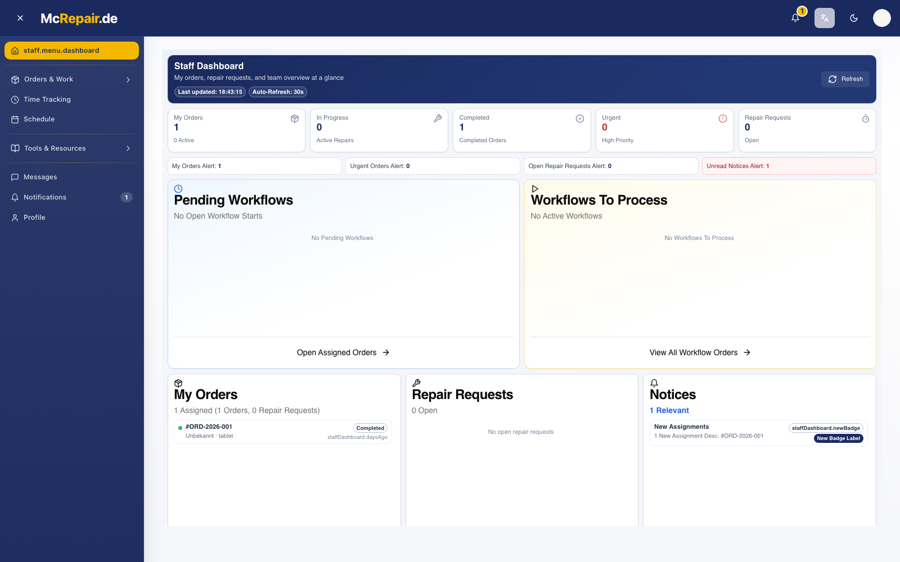

**Route:** `/staff`

**Zweck:**
Die Startseite verdichtet die aktuelle Arbeitssituation eines Mitarbeiters: zugewiesene Auftraege, offene Workflows, Reparaturanfragen und Hinweise.

**Interface-Funktionen:**
- KPI-Kacheln fuer eigene Auftraege, aktive Reparaturen, abgeschlossene Auftraege und Prioritaeten
- Uebersicht ueber offene Workflows und zu bearbeitende Workflow-Auftraege
- Liste der eigenen Auftraege
- Block fuer Reparaturanfragen
- Block fuer Hinweise/Notices
- Manueller Refresh
- Auto-Refresh im Intervall

**Angezeigt wird:**
- persoenlich relevante Arbeitslast
- offene oder abgeschlossene zugewiesene Auftraege
- Hinweise auf neue Zuweisungen oder Benachrichtigungen

**Wann die Seite genutzt wird:**
- Schichtbeginn
- Zwischenkontrolle der eigenen Last
- Schnelleinstieg in offene Auftraege

### 4.2 Orders & Work

Der Sidebar-Bereich `Orders & Work` fasst die drei wichtigsten Arbeitslisten zusammen:
- `My Orders`
- `Repair Requests`
- `Bookings`

#### My Orders

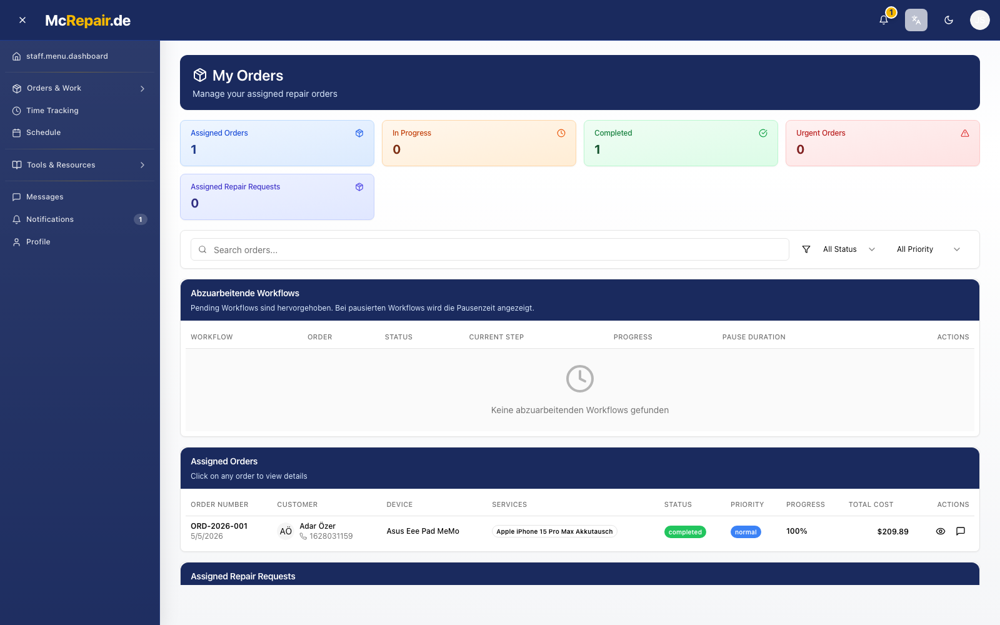

**Route:** `/staff/orders`

**Zweck:**
Diese Seite ist die primaere Arbeitsliste fuer Techniker und Staff-Mitarbeiter.

**Interface-Funktionen:**
- Statistikkarten fuer eigene Auftragslage
- Such- und Filterfunktionen
- Tabelle fuer `Workflows To Process`
- Tabelle fuer `Assigned Orders`
- Direkte Navigation in die Auftragsdetailseite

**Angezeigt wird:**
- nur staff-relevante oder zugewiesene Auftraege
- Workflow-bezogene Arbeitsschritte
- Geraet, Status, Prioritaet und Bearbeitungsstand

**Bedienlogik:**
1. Auftrag in der Liste identifizieren.
2. Status und Prioritaet abgleichen.
3. Ueber `View Order` bzw. den Link in `/orders/:id` springen.
4. Dort alle technischen und organisatorischen Aktionen ausfuehren.

#### Repair Requests

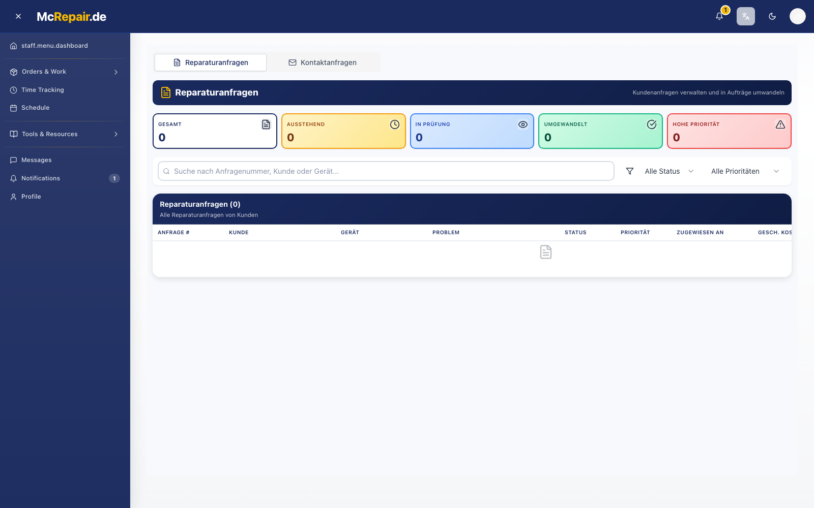

**Route:** `/staff/repair-requests`

**Zweck:**
Die Seite verwaltet eingehende Reparaturanfragen vor der Umwandlung in konkrete Auftraege.

**Wichtig:**
Die Staff-Route nutzt dieselbe Management-Seite wie der Admin-Bereich. Staff sieht damit eine vollwertige Arbeitsansicht fuer Anfragen, inklusive Detaildialogen und Folgeschritten.

**Interface-Funktionen:**
- Statistik-Kacheln fuer Status und Prioritaeten
- Suche und Filter fuer Status/Prioritaet
- Tabellenansicht aller sichtbaren Reparaturanfragen
- Detaildialog pro Anfrage
- Status- und Prioritaetsaenderung
- Staff-Zuweisung
- interne Notizen
- Nachricht an den Kunden
- Umwandlung in Auftrag

**Typischer Ablauf:**
1. Anfrage oeffnen.
2. Angaben zum Geraet und Problem pruefen.
3. Prioritaet und Staff-Zuweisung setzen.
4. Bei geklaertem Fall in einen Auftrag ueberfuehren.

#### Bookings

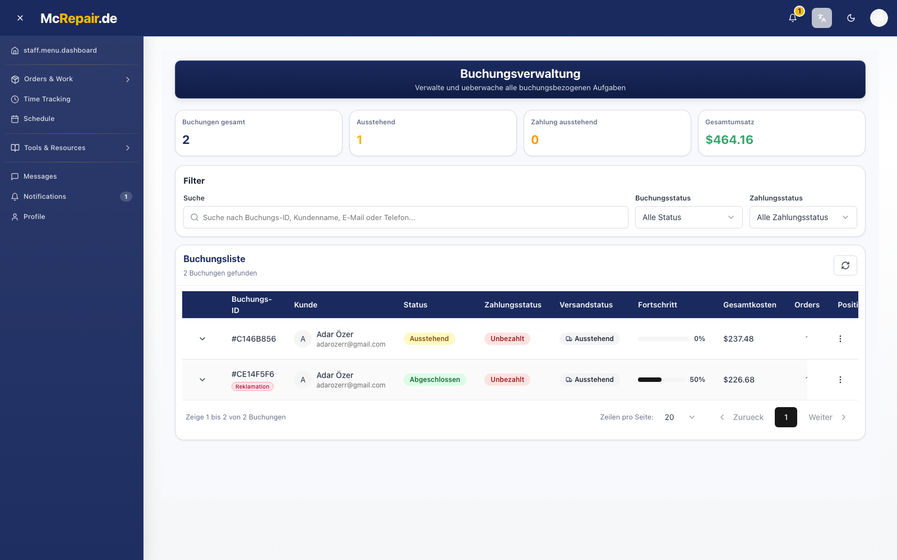

**Route:** `/staff/bookings`

**Zweck:**
Die Buchungsverwaltung zeigt Kundenbuchungen, zugeordnete Positionen und den Bezug zu daraus entstehenden oder bereits verbundenen Auftraegen.

**Wichtig:**
Auch diese Staff-Route verwendet die gemeinsame Buchungsverwaltung aus dem Admin-Bereich. Der Vorteil ist, dass Staff auf dieselben Detail- und Kommunikationswerkzeuge zugreifen kann.

**Interface-Funktionen:**
- Buchungsliste mit Suche und Filtern
- Detaildialog pro Buchung
- Status- und Billing-Status-Aenderung
- Zugriff auf zugehoerige Auftraege
- Kommunikationsfunktionen auf Auftragsebene
- Versand- und Retoureninformationen

**Wann die Seite genutzt wird:**
- wenn ein Auftrag ueber eine Buchung nachvollzogen werden muss
- fuer Versand- und Ruecksendekontext
- fuer Kundenabgleich bei mehreren Positionen in einer Buchung

### 4.3 Time Tracking

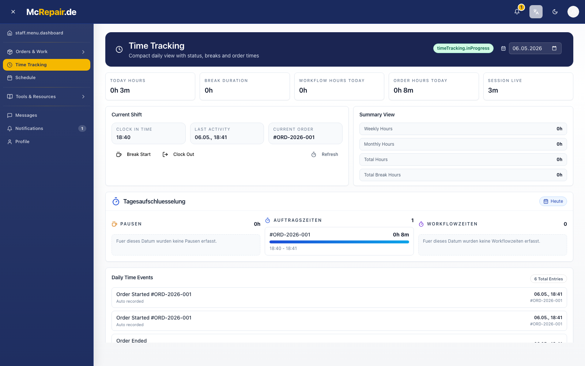

**Route:** `/staff/time-tracking`

**Zweck:**
Diese Seite steuert die persoenliche Zeiterfassung des Mitarbeiters.

**Interface-Funktionen:**
- `Clock in`
- `Clock out`
- `Start Break`
- `End Break`
- Tagesauswahl
- Zusammenfassungen fuer Arbeitszeit, Pausenzeit, Workflow-Zeit und Order-Zeit
- Zeitverlaufs- und Aktivitaetsliste

**Angezeigt wird:**
- aktueller Status des Mitarbeiters (`working`, `on_break`, `online`, `pending`)
- aktive Session mit Uhrzeit und Dauer
- Zeitbeitraege fuer den ausgewaehlten Tag

**Wichtige Logik:**
- Die Seite ist die explizite manuelle Zeiterfassung.
- Zusaetzlich startet die Auftragsdetailseite fuer Staff/Admin order-bezogene Tracking-Prozesse automatisch beim Oeffnen eines Auftrags.
- Dadurch gibt es neben der Tageszeit auch konkrete Zeitspuren pro Auftrag.

**Typischer Tagesablauf:**
1. `Clock in` zu Schichtbeginn.
2. `Start Break` und `End Break` fuer Pausen.
3. Auftragsarbeit ueber die Auftragsdetailseite erledigen.
4. `Clock out` am Ende der Schicht.

### 4.4 Schedule

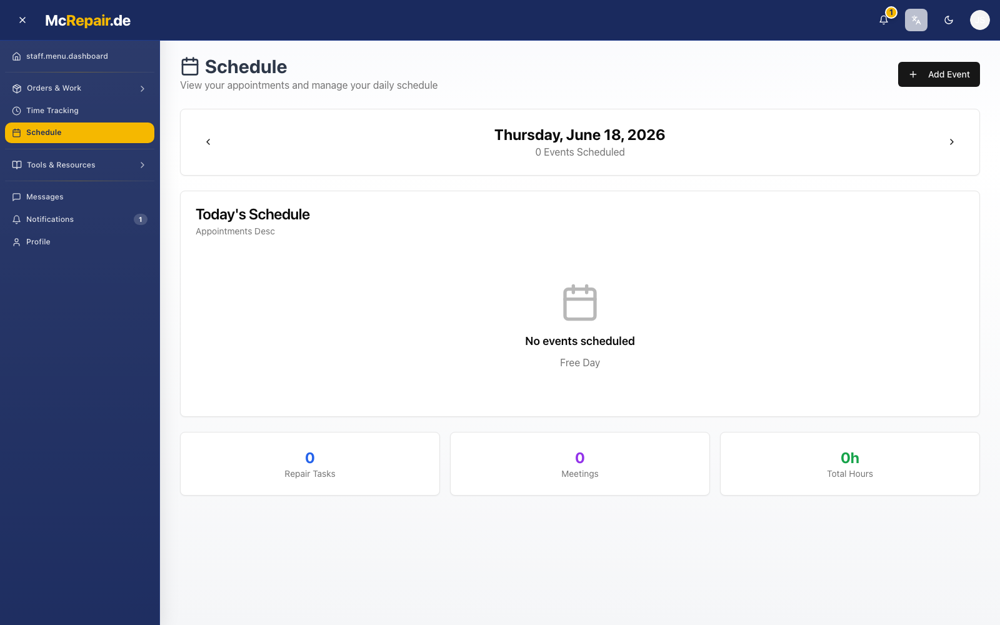

**Route:** `/staff/schedule`

**Zweck:**
Die Seite visualisiert den Tages- oder Terminplan eines Mitarbeiters.

**Interface-Funktionen:**
- Datumsnavigation vor/zurueck
- Terminliste fuer den gewaehlten Tag
- `Add Event`-Button
- Anzeige von Terminart, Uhrzeit, Kunde, Order-Nummer und Prioritaet

**Aktueller Implementierungsstand:**
- Die Seite arbeitet derzeit mit Mockdaten.
- Sie ist damit visuell und strukturell vorhanden, aber noch keine vollstaendig an das operative Backend gekoppelte Dispositionsansicht.

**Praktische Bedeutung:**
- geeignet fuer die zukuenftige Tagesplanung und Terminabstimmung
- aktuell eher Vorschau auf die geplante Planungslogik als vollstaendig produktive Disposition

### 4.5 Tools & Resources

Der Sidebar-Bereich `Tools & Resources` enthaelt drei Arbeitswerkzeuge, die nicht direkt die Auftragsliste selbst sind, aber den Staff-Alltag unterstuetzen.

#### Knowledge Base

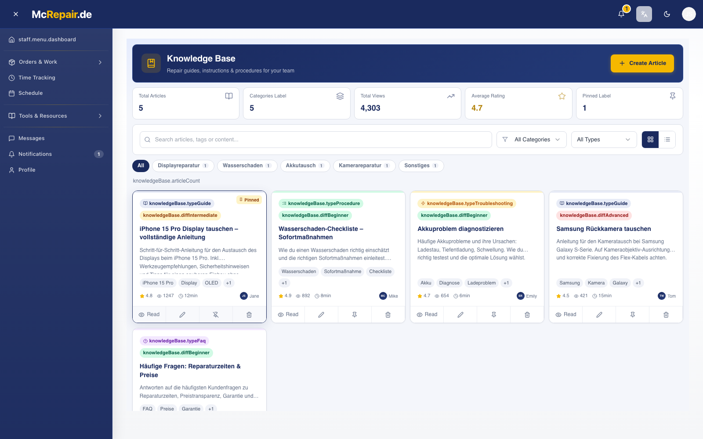

**Route:** `/staff/knowledge-base`

**Zweck:**
Zentrale Wissenssammlung fuer Reparaturwissen, Prozessleitfaeden und interne Informationen.

**Interface-Funktionen:**
- Artikellisten mit Kategorien, Tags und Schwierigkeitsgrad
- Artikelansicht und Detailansicht
- Pflege- oder Bearbeitungsdialoge fuer Inhalte
- Such- und Filtermoeglichkeiten nach Themengebieten

**Anwendungsfaelle:**
- Reparaturprozess nachschlagen
- Sonderfaelle oder Geraetehinweise nachlesen
- internes Prozesswissen zentral verfuegbar machen

#### Team Chat

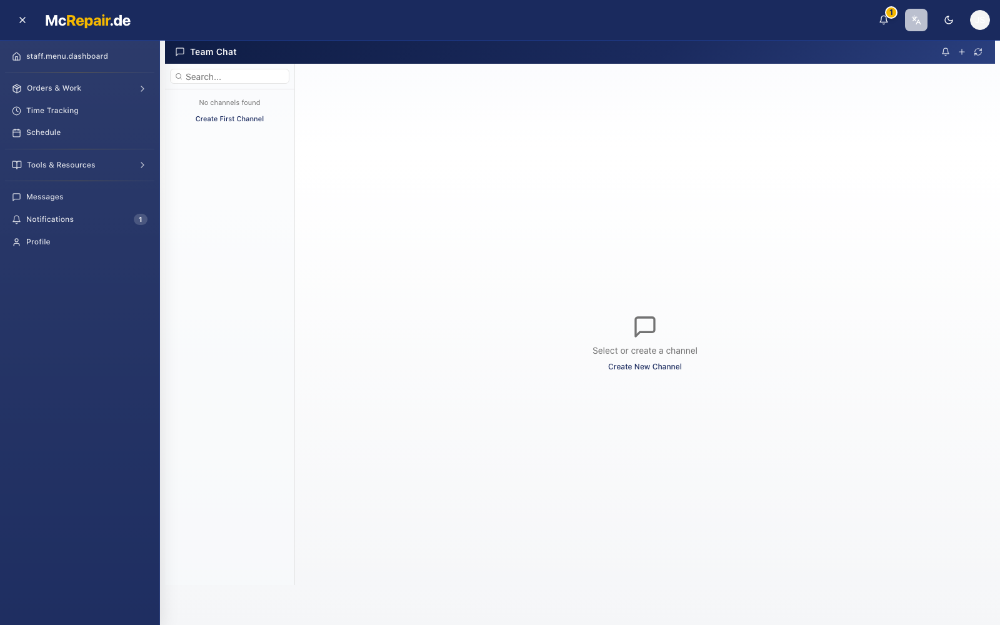

**Route:** `/staff/chat`

**Zweck:**
Interne Teamkommunikation in Raeumen/Channels.

**Interface-Funktionen:**
- Raumliste
- Nachrichtenverlauf pro Raum
- periodisches Aktualisieren/Polling
- Erwaehnungen und Mitgliederkontext
- Dialog zum Erstellen eines neuen Raums

**Anwendungsfaelle:**
- Rueckfragen zu Auftraegen
- Schicht- und Teamabstimmung
- kurze technische oder organisatorische Abstimmungen ohne Kundeneinbindung

#### Performance

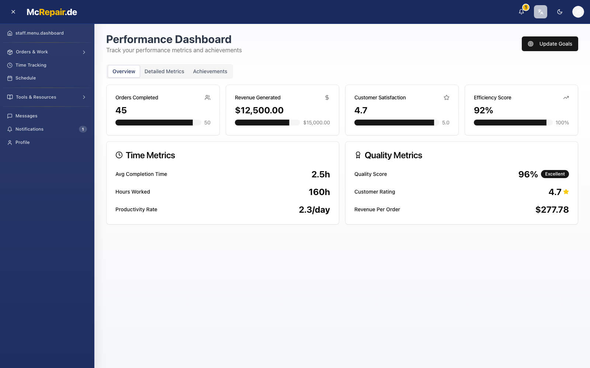

**Route:** `/staff/performance`

**Zweck:**
Persoenliche KPI- und Zielansicht fuer den Mitarbeiter.

**Interface-Funktionen:**
- Kennzahlen zu Abschluessen, Effizienz, Qualitaet, Stunden und Umsatz
- Zielwerte und Zielabgleich
- Achievement-Bereich
- Dialog zum Aktualisieren von Performance-Zielen

**Aktueller Implementierungsstand:**
- Die Seite basiert aktuell auf Mockdaten.
- Die Struktur ist klar definiert, die Kennzahlen sind aber noch nicht vollstaendig aus einem produktiven Performance-Backend gespeist.

### 4.6 Gemeinsame Service-Seiten

#### Messages

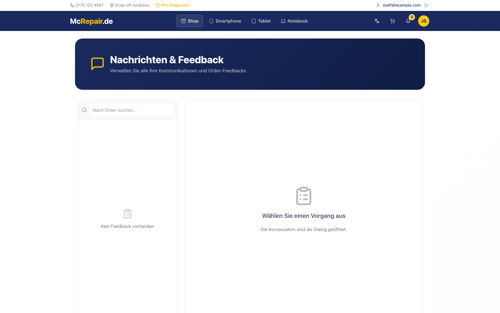

**Route:** `/messages`

**Zweck:**
Gemeinsame Nachrichtenansicht fuer Benutzerkommunikation.

**Hinweis:**
Die Seite ist nicht staff-exklusiv, aber ueber die Staff-Navigation erreichbar und relevant fuer die Kommunikation.

#### Notifications

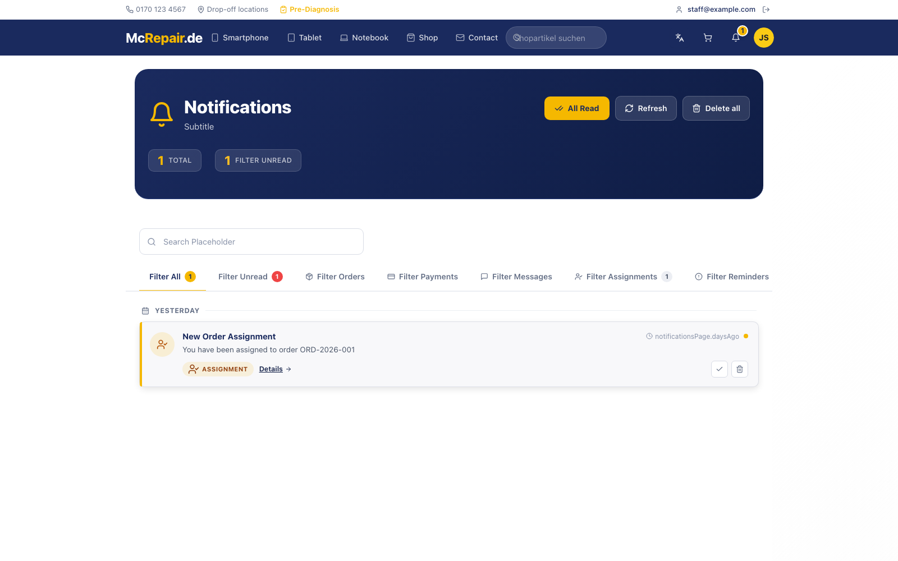

**Route:** `/notifications`

**Zweck:**
Zeigt systemische und operative Benachrichtigungen.

**Wichtig:**
Die Staff-Sidebar pollt die ungelesene Anzahl und zeigt sie als Badge direkt im Menuepunkt an.

#### Profile

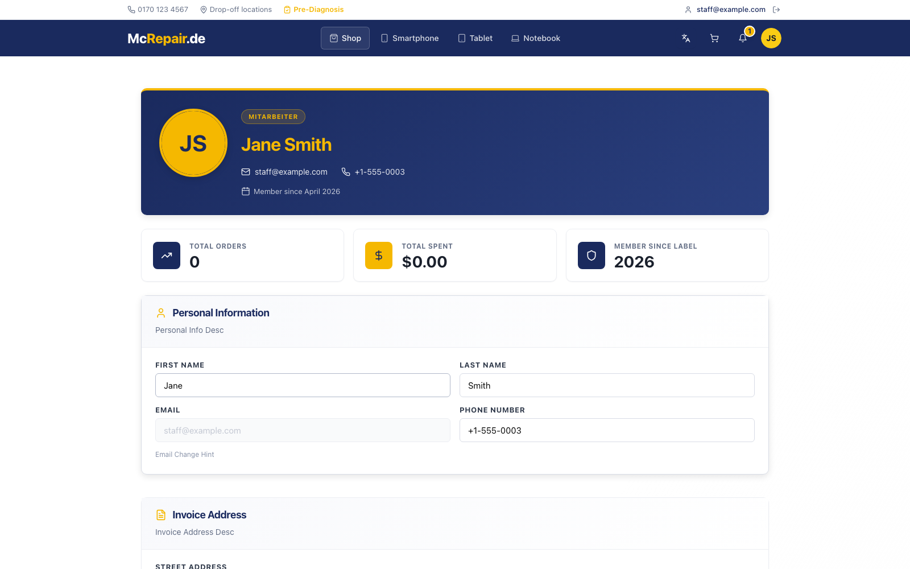

**Route:** `/profile`

**Zweck:**
Persoenliche Profil- und Kontoansicht des angemeldeten Mitarbeiters.

## 5. Kernarbeitsbereich: Die Auftragsdetailseite

Die operative Auftragsbearbeitung findet fuer Staff auf der gemeinsamen Detailseite `/orders/:id` statt.

Einstieg typischerweise ueber:
- `/staff/orders`
- `/staff/bookings`
- Verlinkungen aus Dashboard-Widgets

**Wichtig fuer den Staff-Alltag:**
- Die Seite ist der eigentliche Arbeitsbereich fuer Technik, Statussteuerung, Materialeinsatz, Workflow und Kommunikation.
- Beim Oeffnen eines Auftrags wird fuer Staff/Admin automatisch order-bezogenes Tracking gestartet.
- Beim Verlassen wird dieses Tracking sauber beendet.

### 5.1 Uebersicht und Seitenaufbau

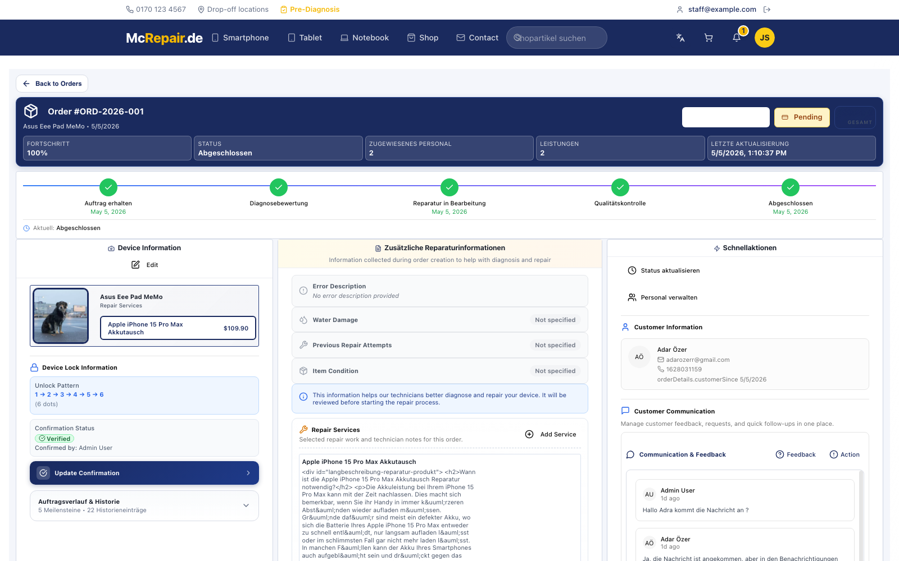

Die Seite ist in drei Zonen gegliedert:

1. Kopfbereich und KPI-Leiste
- Auftragsnummer, Geraet, Datum
- Fortschritt, Status, zugewiesenes Personal, Anzahl Leistungen
- Schnellzugriff auf Status und Gesamtwert

2. Mittlerer Arbeitsbereich
- `Device Information`
- zusaetzliche Reparaturinformationen
- `Repair Services`
- weitere fachliche Karten wie Add-ons, Shop-Produkte, E-Parts und Workflow

3. Rechte Seitenleiste
- Schnellaktionen
- Kundeninformationen
- Kommunikationsbereich
- Staff-Zuweisung

### 5.2 Verbindlicher Standardablauf je Auftrag

1. Auftrag aus `My Orders` oder `Bookings` oeffnen.
2. Kopfbereich auf Status, Fortschritt, zugewiesenes Personal und letzte Aktualisierung pruefen.
3. `Device Information` und Lock-Informationen verifizieren.
4. Device Inspection starten, fortsetzen oder auf Vollstaendigkeit pruefen.
5. Reparaturleistungen, Zusatzleistungen, Shop-Produkte und E-Parts nur anhand des geprueften Bedarfs bearbeiten.
6. Workflow zuweisen, starten oder fortfuehren.
7. Personalzuordnung bei Bedarf aktualisieren.
8. Kommunikation, Feedback und relevante Feststellungen im Auftrag dokumentieren.
9. Auftragsstatus erst nach fachlicher Plausibilisierung in die naechste Phase ueberfuehren.

### 5.3 Device Information und Lock-Pruefung

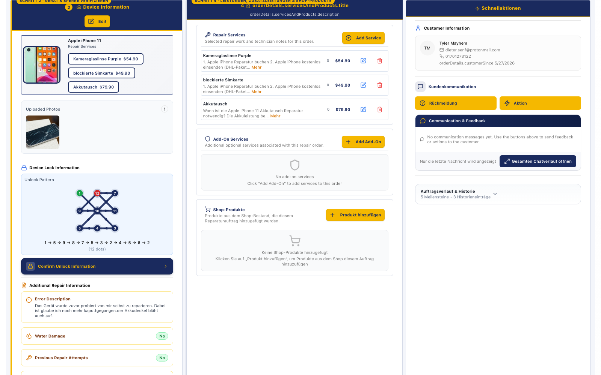

**Was ist enthalten?**
- Geraetebild und Modellinformationen
- gebuchte Hauptleistung
- Lock-Informationen
- Confirm-Status der Entsperrinfo
- Verlauf/Historie des Auftrags

**Bearbeitungsaktionen:**
- `Edit`: oeffnet den Device-Change-Prozess
- `Update Confirmation`: bestaetigt oder korrigiert die Entsperrinformation
- Historie aufklappen fuer Audit- und Nachvollzug

**Warum der Block wichtig ist:**
- Er stellt sicher, dass das richtige Geraet bearbeitet wird.
- Er klaert vor Diagnose oder Reparatur, ob die Entsperrinformation korrekt ist.
- Er dokumentiert technische und organisatorische Vorgeschichte des Auftrags.

**Lock-Logik:**
- Status `Verified`: Code/Muster wurde erfolgreich geprueft.
- Status `Incorrect`: Kundendaten zur Entsperrung sind falsch.
- Status `Unable to Verify`: Pruefung aktuell nicht moeglich.

**Verbindliche Reihenfolge vor technischer Bearbeitung:**
1. Lock-Daten lesen.
2. Physisch pruefen.
3. `Update Confirmation` setzen.
4. Erst danach weitere technische Schritte starten.

### 5.4 Device Inspection

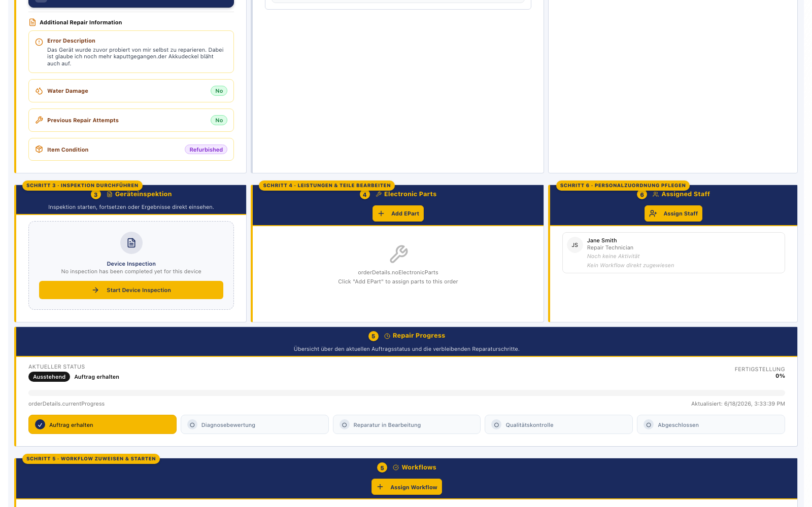

**Zweck:**
Die Device Inspection ist die strukturierte Zustandserfassung des Kundengeraets.

**Funktionen:**
- Inspektion starten oder fortsetzen
- Test- und Zustandsdaten erfassen
- Report als PDF herunterladen

**Was dokumentiert wird:**
- Geraetezustand
- offensichtliche Schaeden
- Testresultate
- Reparierbarkeit
- Zubehoer und relevante Hinweise

**Wann nutzen?**
- beim Geraeteeingang
- bei Rueckfragen zum technischen Ist-Zustand
- vor Abschluss/Quality-Check als Vergleichspunkt

### 5.5 Repair Services

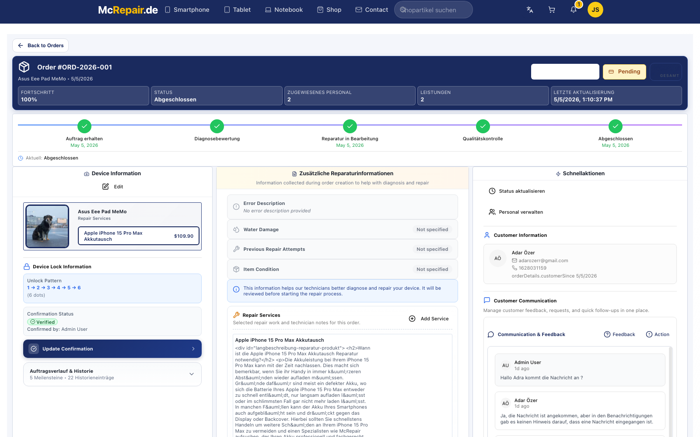

**Zweck:**
Die `Repair Services` bilden die eigentlichen Reparaturpositionen des Auftrags ab.

**Funktionen:**
- `Add Service`
- Serviceposition bearbeiten
- Serviceposition entfernen
- Preis, Zeit und Notizen pflegen

**Wann die Karte verwendet wird:**
- wenn sich bei der Diagnose eine zusaetzliche Reparatur ergibt
- wenn Preise oder Zeiten angepasst werden muessen
- wenn die technische Leistung korrigiert oder konkretisiert werden muss

### 5.6 Wichtige Dialoge auf der Auftragsdetailseite

Die folgenden Dialoge sind die zentralen Bearbeitungsfenster fuer Staff. Sie werden direkt aus der Auftragsdetailseite gestartet.

#### Add-On Service hinzufuegen oder bearbeiten

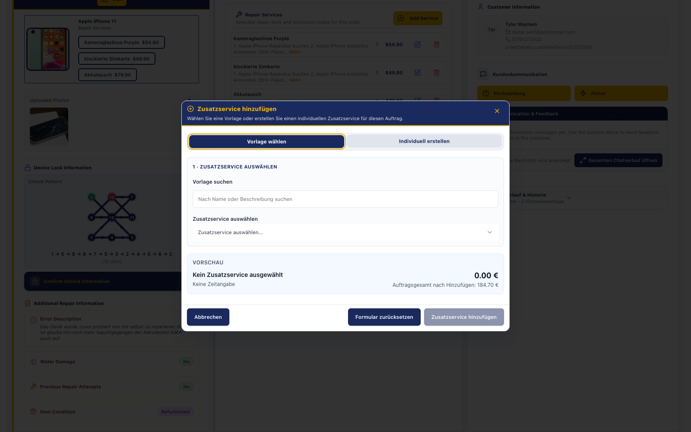

**Zweck:**
Optionale Zusatzleistungen wie Express-Bearbeitung, Datensicherung oder Zusatzchecks koennen hier angelegt werden.

**Funktionen:**
- vordefinierte Vorlage waehlen
- individuellen Zusatzservice erstellen
- Preis, Beschreibung und Zeit pflegen
- Zusatzservice spaeter einem Mitarbeiter zuordnen

#### Shop-Produkt zum Auftrag hinzufuegen

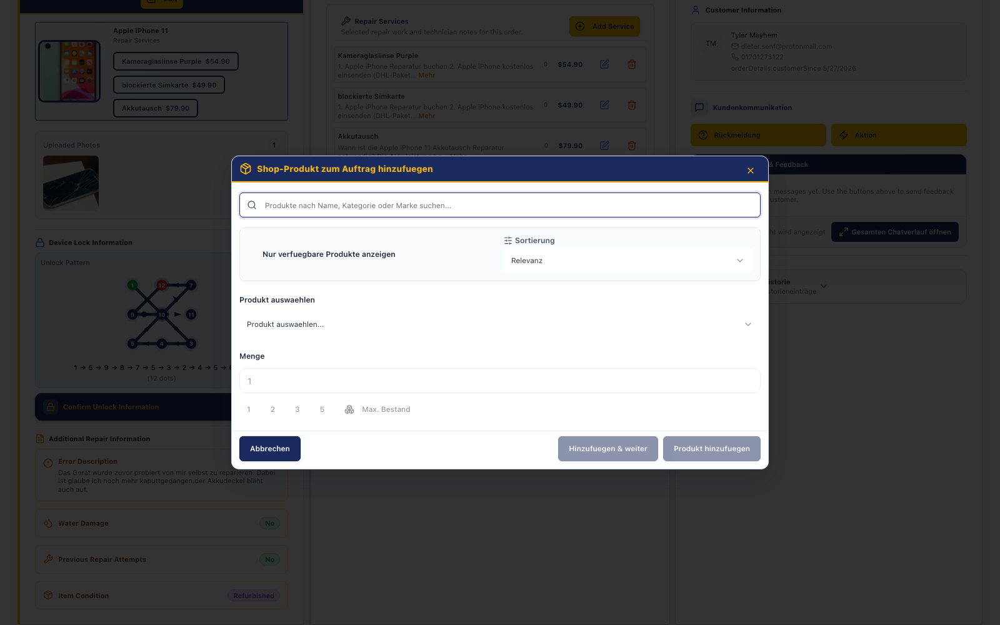

**Zweck:**
Physische Zusatzartikel aus dem Shop koennen direkt dem Auftrag hinzugefuegt werden.

**Funktionen:**
- Produktsuche
- Filter fuer verfuegbare Produkte
- Mengenwahl
- Bestandspruefung

**Typischer Einsatz:**
- Zubehoer oder Cross-Selling direkt mit dem Reparaturauftrag abrechnen.

#### E-Part dem Auftrag zuweisen

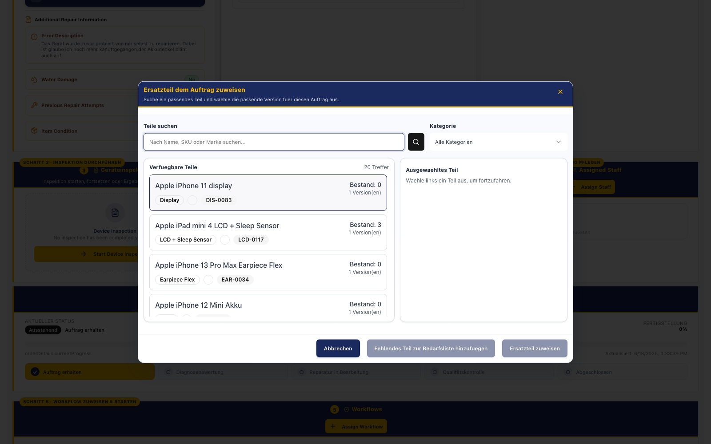

**Zweck:**
Ersatzteile aus dem internen Bestand werden einem Auftrag fachlich und lagerseitig zugeordnet.

**Funktionen:**
- Teilsuche
- Auswahl einer konkreten Teileversion
- Mengenpruefung gegen Bestand
- direkte Zuordnung zum Auftrag

**Wirkung:**
- Materialeinsatz wird dokumentiert.
- Lagerbezug wird unmittelbar hergestellt.

#### Workflow zuweisen

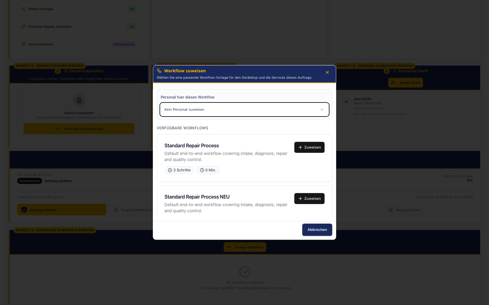

**Zweck:**
Dem Auftrag wird eine definierte Prozessvorlage zugewiesen.

**Funktionen:**
- Vorlage auswaehlen
- Workflow an den Auftrag haengen
- spaeter starten, fortsetzen, pausieren oder reporten

**Warum wichtig:**
- Workflows geben Struktur in der Bearbeitung.
- Sie beeinflussen den Fortschrittswert und die Prozesssicht im Auftrag.

#### Staff zuweisen

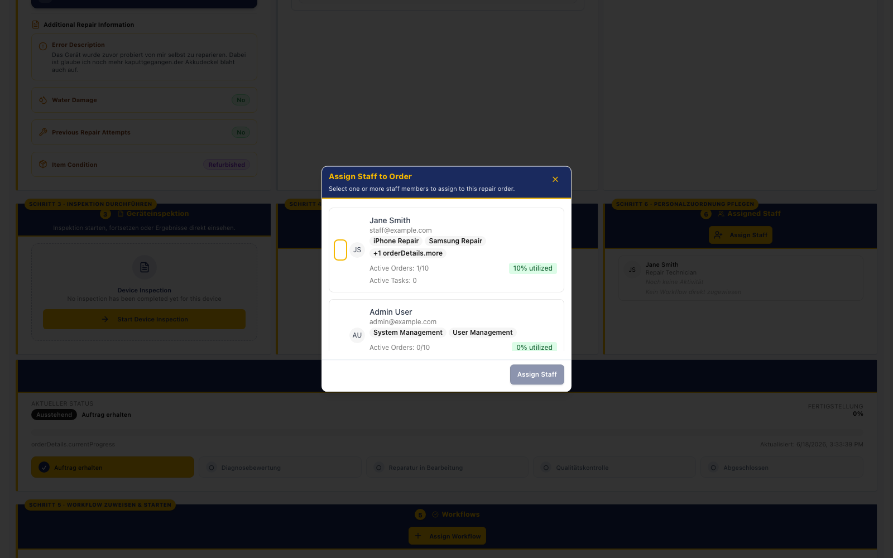

**Zweck:**
Mitarbeiter werden dem Auftrag formal zugeordnet.

**Funktionen:**
- einen oder mehrere Mitarbeiter auswaehlen
- Zuordnung direkt am Auftrag speichern

**Nutzen:**
- klare Verantwortlichkeiten
- bessere Lastverteilung
- nachvollziehbare Bearbeitung und Zeiterfassung

### 5.7 Weitere relevante Auftragsfunktionen

Zusatzlich zu den bebilderten Dialogen stehen auf der Seite weitere wichtige Staff-Funktionen bereit:

#### Status aktualisieren
- Schnellaktion im rechten Bereich.
- Nutzt den realen Reparaturfortschritt als Grundlage.
- Typische Stati: `pending`, `in-progress`, `paused`, `quality-check`, `ready-for-pickup`, `completed`, `cancelled`.

#### Personal verwalten
- Schnellaktion fuer Organisationsaenderungen.
- Ergaenzt die direkte Staff-Zuweisung am Auftrag.

#### Kommunikation & Feedback
- Nachrichtenverlauf direkt am Auftrag.
- Rueckfragen, Kundenantworten und interne Nachverfolgbarkeit bleiben im Kontext des Auftrags.

#### Auftragsverlauf & Historie
- zeigt Statuswechsel, Aktionen und Systemereignisse.
- wichtig fuer Reklamationen, Rueckfragen und Qualitaetssicherung.

### 5.8 Pruef- und Abschlussroutine auf der Detailseite

1. Auftrag oeffnen und Kopfbereich plausibilisieren.
2. Geraet und Lock-Daten pruefen.
3. Device Inspection abschliessen oder fortsetzen.
4. Reparaturleistungen fachlich sauber pflegen.
5. Add-ons, Shop-Produkte und E-Parts nur bei echter Notwendigkeit hinzufuegen.
6. Workflow sauber zuweisen und fortschreiben.
7. Staff-Zuordnung aktuell halten.
8. Kommunikation im Auftrag dokumentieren.
9. Status am Ende jeder wesentlichen Phase aktualisieren.

## 6. Operative Hinweise und Besonderheiten

### 6.1 Gemeinsame Seiten mit dem Admin-Bereich
Folgende Staff-Routen verwenden intern dieselben Management-Komponenten wie Admin:
- `/staff/bookings`
- `/staff/repair-requests`

Das ist fachlich sinnvoll, weil Staff dadurch dieselben Detailwerkzeuge, Statusdialoge und Kommunikationsfunktionen nutzen kann, ohne eine zweite abgespeckte Paralleloberflaeche pflegen zu muessen.

### 6.2 Geteilte Auftragsdetailseite
Die Route `/orders/:id` ist eine gemeinsame Detailseite fuer mehrere Rollen.

Praktische Auswirkung:
- `staff` und `admin` sehen die volle Bearbeitungsoberflaeche.
- `customer` sieht eine reduzierte Informations- und Kommunikationssicht.

### 6.3 Mock-/Vorschau-Bereiche
Aktuell sind folgende Staff-Seiten strukturell vorhanden, aber noch nicht vollstaendig an produktive Backend-Daten gekoppelt:
- `/staff/schedule`
- `/staff/performance`

Die Seiten sollten deshalb als UI- und Prozessvorschau verstanden werden, nicht als finale Quelle fuer dispositive oder leistungsbezogene Entscheidungen.

## 7. Einarbeitungsablauf fuer neue Staff-Mitarbeiter

Der folgende Ablauf eignet sich als interne Schulungsreihenfolge fuer neue Mitarbeiter:

1. Schichtstart verstehen: `/staff` aufrufen und KPI-Bloecke lesen koennen.
2. Zeiterfassung korrekt ausfuehren: `/staff/time-tracking` mit `Clock in`, Pause und `Clock out` bedienen koennen.
3. Arbeitslisten unterscheiden: `/staff/orders`, `/staff/repair-requests` und `/staff/bookings` funktional voneinander abgrenzen koennen.
4. Auftragsdetailseite sicher bedienen: Geraet, Lock, Inspektion, Leistungen, Material und Workflow nacheinander bearbeiten koennen.
5. Dokumentationspflichten verstehen: Kommunikation, Statuswechsel und relevante Aenderungen im Auftrag nachvollziehbar festhalten.
6. Schichtabschluss sicherstellen: offene Punkte, Benachrichtigungen und laufende Auftraege vor Arbeitsende pruefen.

## 8. Lernkontrolle und betriebliche Mindeststandards

Ein Mitarbeiter gilt fuer den Staff-Bereich als arbeitsfaehig eingewiesen, wenn folgende Punkte sicher beherrscht werden:

- die eigene Auftragsliste kann ohne Hilfestellung gelesen und priorisiert werden
- ein Auftrag kann vollstaendig von der Pruefung bis zur Statusfortschreibung bearbeitet werden
- Lock-Informationen und Device Inspection werden vor technischer Bearbeitung korrekt behandelt
- Leistungen, Zusatzleistungen und Material werden nur fachlich begruendet angepasst
- Kommunikation wird im richtigen Kontext und ohne Medienbruch dokumentiert
- Mock- oder Vorschau-Bereiche werden nicht mit produktiven Steuerungsdaten verwechselt

## 9. Zusammenfassung
Der Staff-Bereich ist als operative Arbeitsumgebung fuer den Tagesbetrieb konzipiert. Die Sidebar fuehrt zunaechst durch Uebersicht, Arbeitslisten, Zeitsteuerung und Hilfswerkzeuge. Die fachlich entscheidende Bearbeitung konzentriert sich anschliessend auf die Auftragsdetailseite. Wer den Ablauf `Dashboard -> Orders -> OrderDetails -> Pruefung -> Bearbeitung -> Dokumentation -> Statusfortschreibung` sicher beherrscht, kann den Grossteil der taeglichen Staff-Aufgaben regelkonform und nachvollziehbar abdecken.